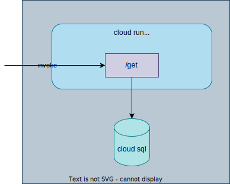

# Cloud Run with Cloud SQL



## Prerequisite

```
gcloud auth login --update-adc
INSTANCE_NAME=naka-test
ZONE=asia-northeast1-b
REGION=asia-northeast1
SA_NAME=helloworld
DB_NAME=test_db
```

## Local run

Local run with local db:

```
cd helloworld
DB_HOST=localhost DB_USER=postgres DB_NAME=test_db DB_PASS=postgres go run main.go
```

Local run with cloud sql

```
cd helloworld
DB_HOST=localhost DB_USER=your@gmail.com DB_NAME=test_db DB_PASS=$(gcloud sql generate-login-token) go run main.go
```

## Set Up Cloud SQL

1. Create Cloud SQL instance

    ```
    gcloud sql instances create $INSTANCE_NAME \
    --database-version=POSTGRES_15 \
    --cpu=1 \
    --memory=3840MiB \
    --zone=$ZONE \
    --root-password=test \
    --database-flags=cloudsql.iam_authentication=on \
    --project $PROJECT
    ```

1. Create database

    ```
    gcloud sql databases create $DB_NAME --instance=$INSTANCE_NAME --project $PROJECT
    ```
1. Create table `test_db.accounts` for `<sa_name>@<project>.iam`

    ```
    gcloud sql connect $INSTANCE_NAME --user=postgres --quiet --project $PROJECT
    ```

    ```sql
    \c test_db
    ```

    ```
    CREATE TABLE accounts (
    user_id serial PRIMARY KEY,
    username VARCHAR ( 50 ) UNIQUE NOT NULL,
    password VARCHAR ( 50 ) NOT NULL,
    email VARCHAR ( 255 ) UNIQUE NOT NULL,
    created_on TIMESTAMP NOT NULL,
    last_login TIMESTAMP
    );
    ```

    ```
    insert into accounts values (1, 'uid', 'password', 'email@gmail.com', '2023-07-12 00:00:00', '2023-07-12 00:01:00');
    ```

    ```
    alter table accounts owner to "<sa_name>@<project>.iam";
    ```

1. Create table `test_db2.accounts` for `postgres`

    ```
    cloud-sql-proxy $PROJECT:$REGION:$INSTANCE_NAME
    ```

    ```
    gcloud sql users set-password postgres \
        --instance=$INSTANCE_NAME \
        --project=$PROJECT \
        --prompt-for-password
    ```

    ```
    psql --host=localhost --username=postgres --dbname=postgres
    ```

    ```
    create database test_db2;
    \c test_db2
    ```


    ```
    CREATE TABLE accounts (
    user_id serial PRIMARY KEY,
    username VARCHAR ( 50 ) UNIQUE NOT NULL,
    password VARCHAR ( 50 ) NOT NULL,
    email VARCHAR ( 255 ) UNIQUE NOT NULL,
    created_on TIMESTAMP NOT NULL,
    last_login TIMESTAMP
    );
    ```

    ```
    insert into accounts values (1, 'uid', 'password', 'email@gmail.com', '2023-07-12 00:00:00', '2023-07-12 00:01:00');
    ```


1. Create a Service Account for Cloud Run, which is also used for IAM database authentication for Cloud SQL
    ```
    gcloud iam service-accounts create $SA_NAME \
        --description="hello world cloud run service" \
        --display-name="helloworld" \
        --project=$PROJECT
    ```

1. Create Cloud SQL user for the service account

    ```
    gcloud sql users create $SA_NAME@$PROJECT.iam \
    --instance=$INSTANCE_NAME \
    --type=cloud_iam_user --project $PROJECT
    ```
1. Grant roles to the service account

    ```
    gcloud projects add-iam-policy-binding $PROJECT \
        --member=serviceAccount:$SA_NAME@$PROJECT.iam.gserviceaccount.com \
        --role=roles/cloudsql.instanceUser
    ```
    ```
    gcloud projects add-iam-policy-binding $PROJECT \
        --member=serviceAccount:$SA_NAME@$PROJECT.iam.gserviceaccount.com \
        --role=roles/cloudsql.client
    ```

    1. [IAM add-iam-policy-binding](https://cloud.google.com/sdk/gcloud/reference/projects/add-iam-policy-binding)
    1. [Cloud SQL IAM Roles](https://cloud.google.com/sql/docs/postgres/iam-roles)

1. Grant permission (ToDo)
    ```
    gcloud sql connect $INSTANCE_NAME --user=postgres --quiet --project $PROJECT
    ```

    ```
    grant cloudsqlsuperuser to "helloworld@<project_id>.iam";
    ```

## Deploy Cloud Run


### Access with IAM database authentication (Not confirmed yet)

```
DB_HOST=$(gcloud sql instances describe $INSTANCE_NAME --project $PROJECT --format json | jq -r '.ipAddresses[] | select(.type == "PRIMARY").ipAddress')
gcloud run deploy helloworld --service-account $SA_NAME@$PROJECT.iam.gserviceaccount.com \
    --source ./helloworld \
    --set-env-vars CLOUD_SQL_WITH_IAM_AUTH=true \
    --set-env-vars INSTANCE_CONNECTION_NAME=$PROJECT:$REGION:$INSTANCE_NAME \
    --set-env-vars DB_NAME=test_db \
    --set-env-vars DB_IAM_USER=$SA_NAME@$PROJECT.iam \
    --project $PROJECT \
    --region $REGION
```

```
curl https://helloworld-xxx-an.a.run.app
Hello World!
```

### Access with built-in auth (OK)

1. Create secret manager `DB_PASS`

    ```
    gcloud secrets create DB_PASS \
        --replication-policy="automatic" --project $PROJECT
    echo -n "<pass>" | \
        gcloud secrets versions add DB_PASS --data-file=- --project $PROJECT
    ```

    - [create secret](https://cloud.google.com/secret-manager/docs/creating-and-accessing-secrets#secretmanager-create-secret-gcloud)
    - [add secret version](https://cloud.google.com/secret-manager/docs/add-secret-version)

1. Grant roles to the service account

    ```
    gcloud secrets add-iam-policy-binding DB_PASS \
        --member="serviceAccount:$SA_NAME@$PROJECT.iam.gserviceaccount.com" \
        --role="roles/secretmanager.secretAccessor" --project $PROJECT
    ```

1. Deploy
    ```
    gcloud run deploy helloworld --service-account $SA_NAME@$PROJECT.iam.gserviceaccount.com \
        --source ./helloworld \
        --set-env-vars CLOUD_SQL_WITH_BUILT_IN_USER=true \
        --set-env-vars INSTANCE_CONNECTION_NAME=$PROJECT:$REGION:$INSTANCE_NAME \
        --set-env-vars DB_NAME=test_db2 \
        --set-env-vars DB_USER=postgres \
        --set-secrets DB_PASS=DB_PASS:latest \
        --project $PROJECT \
        --region $REGION
    ```

    - [connect from cloud run](https://cloud.google.com/sql/docs/postgres/connect-run)

## Clean up

```
gcloud run services delete helloworld --project $PROJECT --region $REGION
gcloud sql instances delete $INSTANCE_NAME --project $PROJECT
gcloud iam service-accounts delete $SA_NAME --project $PROJECT
gcloud secrets delete DB_PASS --project $PROJECT
```

## Ref

1. [connect from cloud run](https://cloud.google.com/sql/docs/postgres/connect-run)
1. [create secret](https://cloud.google.com/secret-manager/docs/creating-and-accessing-secrets#secretmanager-create-secret-gcloud)
1. [add secret version](https://cloud.google.com/secret-manager/docs/add-secret-version)
1. [IAM add-iam-policy-binding](https://cloud.google.com/sdk/gcloud/reference/projects/add-iam-policy-binding)
1. [Cloud SQL IAM Roles](https://cloud.google.com/sql/docs/postgres/iam-roles)
