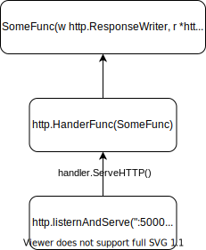
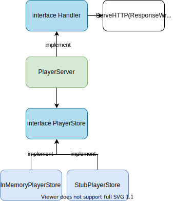

# Build an application

- GET `/players/<player>`
- POST `/players/<player>`

## Run the app

```
go build
```

```
curl http://localhost:5000/players/Pepper
```

```
curl -X POST http://localhost:5000/players/Pepper
```

## Server


### Step 1: Implement some function and make handler with HandlerFunc



```go
func ListenAndServe(addr string, handler Handler) error

type Handler interface {
    ServeHTTP(ResponseWriter, *Request)
}
```

[HandlerFunc](https://pkg.go.dev/net/http#HandlerFunc)

The `HandlerFunc` type is an adapter to allow the use of ordinary functions as HTTP handlers.

```go
func PlayerServer(w http.ResponseWriter, r *http.Request) {
    player := strings.TrimPrefix(r.URL.Path, "/players/")
    fmt.Fprint(w, GetPlayerScore(player))
}

func GetPlayerScore(name string) string {
    if name == "Pepper" {
        return "20"
    }
    if name == "Floyd" {
        return "10"
    }
    return ""
}
```

### Step 2: Implement Handler



```go
type PlayerServer struct {
    store PlayerStore
}

func (p *PlayerServer) ServeHTTP(w http.ResponseWriter, r *http.Request) {
    player := strings.TrimPrefix(r.URL.Path, "/players/")
    fmt.Fprint(w, p.store.GetPlayerScore(player))
}
```

## Step 3: Routing with [ServeMux](https://golang.org/pkg/net/http/#ServeMux)

```go
router := http.NewServeMux()
router.Handle("/league", http.HandlerFunc(funcA))
router.Handle("/players/", http.HandlerFunc(funcB))

func funcA(w http.ResponseWriter, r *http.Request) {
    // logic for league
}

func funcB(w http.ResponseWriter, r *http.Request) {
    // logic for player
}
```

## Step 4: Set Routing in NewPlayerServer

```go
func NewPlayerServer(store PlayerStore) *PlayerServer {
    p := &PlayerServer{
        store,
        http.NewServeMux(),
    }
    p.router.Handle("/league", http.HandlerFunc(p.leagueHandler))
    p.router.Handle("/players/", http.HandlerFunc(p.playersHandler))
    return p
}
```

## Step 5: Replace `ServeHTTP()` with `http.Handler` in `PlayerServer` by ***embedding***

https://pkg.go.dev/net/http#HandlerFunc.ServeHTTP


```go
type PlayerServer struct {
    store PlayerStore
	http.Handler // embedding: our PlayerServer now has all the methods that http.Handler has, which is just ServeHTTP.
}
```

[***embedding***](https://golang.org/doc/effective_go#embedding): *Go does not provide the typical, type-driven notion of subclassing, but it does have the ability to “borrow” pieces of an implementation by embedding types within a struct or interface.*


```go
func NewPlayerServer(store) *PlayerServer {
    p := new(PlayerServer)
    router := http.NewServerMux()
    ..
    p.Hander = router
    return p
}
```

We can call `ServeHTTP`

```go
store := StubPlayerStore{}
server := NewPlayerServer(&store)
server.ServeHTTP(w, r)
```

**Embedding** is a very interesting language feature. You can use it with interfaces to compose new interfaces. But you need to be careful with misuse (unintended exposion of methods of the embedded class).

```go
type Animal interface {
    Eater
    Sleeper
}
```

**SideNote**: about http.Handler & ServeMux

The process of the following code is nearly the same:
1. set the handler with `Handle` func
    ```go
    http.Handle("/any/", anyHandler)
    http.ListenAndServe(":8080", nil)
    ```
1. set the handler with `ServeMux`
    ```go
    mux := http.NewServeMux()
    mux.Handle("/any/", anyHandler)
    http.ListenAndServe(":8080", mux)
    ```

## Step 6: JSON encode and decode

- Use `encoding/json` package
- Encode `NewEncoder` with `io.Writer` (`http.ResponseWriter` in the example)
    ```go
    json.NewEncoder(w).Encode(leagueTable)
    ```
- Decode `newDecoder` with `io.Reader` (`response.Body` <- `*bytes.Buffer`)
    ```go
    obj := []Object
    json.NewDecoder(r).Decode(&obj)
    ```

## Step 7: Persist data with JSON file

- `FileSystemPlayerStore` with `database` as `io.Reader`
- Use `strings.NewReader`to create database with JSON string.
    - `newDecoder` to read json as object.

-> this implementation cannot read same thing twice once the Reader reachs the end

## Step 8: ReadSeeker: Seek(offset, whence) enables us to read multiple times

[ReadSeeker](https://golang.org/pkg/io/#ReadSeeker) interface

```go
type ReadSeeker struct {
    Reader
    Seeker
}
```

You can set offset and whence with:

```go
f.database.Seek(0, 0)
```

Luckily, `string.NewReader` also implements `ReadSeeker`.

## Step 9: ReadWriteSeeker

`strings.Reader` does not implement `ReadWriteSeeker`

- Create a temporary file: `*os.File` implements `ReadWriteSeeker`
- Use a [filebuffer](https://github.com/mattetti/filebuffer) library [Mattetti](https://github.com/mattetti): implements the interface

Replace `strings.Reader` with `*os.File` returned by `ioutil.TempFile("", "db")`.

```go
json.NewEncoder(f.database).Encode(league)
```
## [Step 10: More refactoring and performance concerns](https://quii.gitbook.io/learn-go-with-tests/build-an-application/io#more-refactoring-and-performance-concerns)

**Problem**: Every time someone calls `GetLeague()` or `GetPlayerScore()` we are reading the **entire** file and parsing it into JSON. -> Wasteful
**Solution**: Read the whole file only when starting up

1. `GetLeague` just returns from the member variable

    ```go
    func (f *FileSystemPlayerStore) GetLeague() League {
        return f.league
    }
    ```
1. `RecordWins` updates the member variable `league` and write with `f.database` (`io.ReadWriteSeeker`)

## [Step 11: tape.go](https://quii.gitbook.io/learn-go-with-tests/build-an-application/io#write-enough-code-to-make-it-pass-4)

Enable to delete data. (Case that new data is smaller than old data. e.g. Write `12345` -> Write `abc` -> Read `abc45` <- Wrong!!) -> Separate out the concern of the kind of **data we write**, from **the writing**

1. Introduce `tape.go`: encapsulate our **"when we write we go from the beginning" functionality**.
    ```go
    type tape struct {
        file io.ReadWriteSeeker
    }
    ```
1. Update database of FileSystemPlayerStore from `io.ReadWriteSeeker` to `io.Writer`.
    ```go
    type FileSystemPlayerStore struct {
        database io.Writer
        league   League
    }
    ```
1. Update constructor of `FileSystemPlayerStore` to use `type`.
    ```go
    func NewFileSystemPlayerStore(database io.ReadWriteSeeker) *FileSystemPlayerStore {
        database.Seek(0, 0)
        league, _ := NewLeague(database)
        return &FileSystemPlayerStore{
            database: &tape{database},
            league:   league,
        }
    }
    ```

Separation of concern completed!

1. Add test case: Write `12345` -> Write `abc` -> Read `abc` (`file` -> `&tape{file}` -> `tape.Write([]byte("abc"))`)
1. `os.File` has a truncate function. Use the type instead of `io.ReadWriteSeeker`
    ```go
    type tape struct {
        file *os.File
    }

    func (t *tape) Write(p []byte) (n int, err error) {
        t.file.Truncate(0)
        t.file.Seek(0, 0)
        return t.file.Write(p)
    }
    ```

    -> The compiler will fail in a number of places. Fix them.

    change **type FileSystemPlayerStore** from `io.Writer` to `*json.Encoder`
